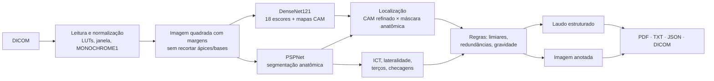

# Interpretador Radiológico

Software de **apoio à decisão** que interpreta radiografias de tórax em **DICOM**, emite um
**pré-laudo estruturado em português** e **marca na imagem os achados patológicos**
(contornos, mapas de calor, rótulos e medida do índice cardiotorácico).


> **Aviso importante.** Este software não é um dispositivo médico certificado. Os resultados
> são gerados por modelos de inteligência artificial e **devem ser revisados, corrigidos e
> assinados por médico(a) radiologista**. O uso clínico no Brasil exige regularização na ANVISA
> (software como dispositivo médico — RDC nº 657/2022).

## Funcionalidades

- **Leitura de DICOM** (CR/DX/DR): LUT de modalidade e VOI, janelamento, `MONOCHROME1/2`,
  múltiplos quadros e sintaxes comprimidas (JPEG, JPEG-LS, JPEG 2000 via `pylibjpeg`).
  PNG/JPEG também são aceitos para demonstração.
- **Classificação de 18 achados**: atelectasia, consolidação, infiltrado, pneumotórax, edema,
  enfisema, fibrose, derrame pleural, pneumonia, espessamento pleural, cardiomegalia, nódulo,
  massa, hérnia, lesão pulmonar, fratura, opacidade pulmonar e alargamento cardiomediastinal.
- **Localização dos achados na imagem**: mapas de ativação (CAM) refinados e restritos à região
  anatômica plausível de cada achado, convertidos em contornos e caixas.
- **Segmentação anatômica** (pulmões, coração, mediastino, coluna…) para descrever
  **lateralidade** e **terço pulmonar** ("no terço inferior do pulmão direito") e medir o
  **índice cardiotorácico (ICT)**, em centímetros quando o DICOM informa o espaçamento de pixel.
- **Laudo estruturado**: identificação, técnica, análise por sistema (pulmões, pleuras, coração,
  mediastino, diafragma, ossos), achados de baixa confiança, medidas, impressão diagnóstica
  (ordenada por gravidade), recomendações e observações técnicas.
- **Saídas**: PDF (com imagem anotada e tabela de escores), texto simples, JSON, PNG anotado e,
  para integração com PACS, **DICOM Secondary Capture** (imagem anotada) e **DICOM Encapsulated
  PDF** (laudo) no mesmo estudo do exame original.
- **Interface web**: visualizador com zoom/arrastar, camadas liga/desliga, opacidade, brilho,
  contraste e inversão; lista de achados com foco na região; **edição do laudo** e identificação do
  revisor antes de gerar o PDF.
- **Verificações de segurança**: recusa outras modalidades/regiões (ex.: joelho, TC), alerta para
  incidência em perfil, paciente pediátrico, imagem possivelmente espelhada/dextrocardia e campos
  pulmonares não identificados.
- **Privacidade (LGPD)**: tudo roda localmente; nenhuma imagem é enviada a serviços externos.
  Opção `--anonimizar` remove nome, ID, data de nascimento e nº de acesso das saídas.

## Instalação

Requer Python 3.10 ou superior.

```bash
git clone https://github.com/andersongroto/interpretador-radiologico.git
cd interpretador-radiologico
python -m venv .venv
source .venv/bin/activate            # Windows: .venv\Scripts\activate

# Opcional: PyTorch apenas para CPU (download bem menor que a versão com CUDA)
pip install torch torchvision --index-url https://download.pytorch.org/whl/cpu

pip install -e ".[dev]"

# Baixa os pesos dos modelos (~230 MB, apenas uma vez; ficam em ~/.torchxrayvision)
interpretador-radiologico baixar-modelos
```

Uma GPU NVIDIA é usada automaticamente se disponível; em CPU a análise leva poucos segundos.

## Uso

### Interface web

```bash
interpretador-radiologico servidor            # http://127.0.0.1:8000
```

Arraste um arquivo `.dcm` para a área da imagem (ou clique em **Abrir exame**). Na aba **Laudo**
edite o texto, informe nome e CRM do revisor e baixe o PDF, o texto ou o laudo em DICOM.

O servidor escuta apenas em `127.0.0.1` por padrão. Para uso em rede, coloque-o atrás de um
proxy com HTTPS e autenticação; os resultados ficam somente em memória (últimos 20 exames).

### Linha de comando

```bash
# Baixa uma radiografia pública (NIH ChestX-ray14) e grava como DICOM de exemplo
interpretador-radiologico exemplo

# Analisa um arquivo: imprime o laudo e grava PDF, PNG, JSON e TXT na pasta indicada
interpretador-radiologico analisar exemplo_torax_pa.dcm -o resultados/

# Analisa uma pasta inteira (inclui DICOMs sem extensão), com saídas DICOM e anonimização
interpretador-radiologico analisar /caminho/estudos -o resultados/ -f pdf,png,json,txt,dcm --anonimizar
```

Principais opções (`interpretador-radiologico analisar --help`):

| Opção | Descrição |
|---|---|
| `-o, --saida PASTA` | Pasta de saída (padrão: a do arquivo) |
| `-f, --formatos` | `pdf,png,json,txt,dcm` (padrão: `pdf,png,json,txt`) |
| `--limiar-positivo 0.60` | Escore mínimo para achado positivo |
| `--limiar-indeterminado 0.55` | Escore mínimo para achado de baixa confiança |
| `--anonimizar` | Remove identificação do paciente das saídas |
| `--instituicao NOME` | Nome do serviço no cabeçalho do laudo |
| `--mostrar-anatomia` | Desenha contornos de pulmões e coração na imagem |
| `--sem-segmentacao` | Desativa a segmentação (sem ICT; lateralidade aproximada) |
| `--sem-refino` | Localização mais rápida e mais grosseira |
| `--dispositivo cpu\|cuda` | Força o dispositivo de execução |
| `--forcar` | Analisa outras regiões/modalidades (resultado sem validade) |

Também é possível usar como biblioteca:

```python
from interpretador_radiologico.analisador import AnalisadorTorax
from interpretador_radiologico.dicom_io import carregar_exame
from interpretador_radiologico.pipeline import processar, salvar

saidas = processar(carregar_exame("exame.dcm"), AnalisadorTorax())
print(saidas.laudo.texto())
for achado in saidas.resultado.positivos:
    print(achado.nome, f"{achado.escore:.0%}", achado.local, [r.caixa for r in achado.regioes])
salvar(saidas, "resultados/")
```

### Exemplo de laudo gerado

Radiografia pública NIH ChestX-ray14 `00000001_000.png` (rótulo de referência: cardiomegalia):

```text
ANÁLISE
Pulmões: Campos pulmonares com transparência preservada, sem opacidades focais ou difusas identificadas. Sem sinais de hiperinsuflação pulmonar.
Pleuras: Seios costofrênicos livres. Ausência de sinais de pneumotórax. Pleuras sem espessamentos evidentes.
Coração: Aumento da área cardíaca, com índice cardiotorácico estimado em 0,53 (escore IA 63%).
Mediastino: Mediastino de contornos e dimensões habituais.
Diafragma: Sem sinais de hérnia diafragmática ou hiatal.
Estruturas ósseas: Arcabouço ósseo sem sinais evidentes de fratura.

MEDIDAS
- Índice cardiotorácico (ICT) estimado: 0,53 — aumentado (referência: até 0,50).

IMPRESSÃO DIAGNÓSTICA
1. Cardiomegalia.

RECOMENDAÇÕES
- Considerar ecocardiograma para avaliação estrutural e funcional.
- Correlacionar com dados clínicos e exames anteriores, se disponíveis.
```

## Como funciona



1. **Leitura** (`dicom_io.py`): aplica LUT de modalidade, janela VOI (ou normalização por
   percentis), corrige `MONOCHROME1` e extrai metadados do paciente e do exame.
2. **Classificação** (`analisador.py`): DenseNet121 do
   [TorchXRayVision](https://github.com/mlmed/torchxrayvision) (`densenet121-res224-all`),
   treinada em oito bases públicas (NIH, PadChest, CheXpert, MIMIC-CXR, RSNA, Google, OpenI,
   Kaggle). Os escores são normalizados pelo ponto de operação de cada patologia.
3. **Localização** (`analisador.py`, `localizacao.py`): como a rede termina em *global average
   pooling* + camada linear, o mapa de ativação de classe (CAM) é exato. Ele é calculado em nove
   versões da imagem deslocadas em meia célula (16 px) e realinhado, dobrando a resolução
   espacial. O mapa é multiplicado por uma máscara anatômica suave (pulmões para nódulos e
   opacidades, tórax para derrame/pneumotórax, coração para cardiomegalia…) e limiarizado em
   regiões conexas, que viram contornos.
4. **Anatomia** (`anatomia.py`): o PSPNet do ChestX-Det segmenta 14 estruturas. Com elas o
   sistema determina o lado do paciente e o terço pulmonar de cada região, calcula o ICT (maior
   diâmetro cardíaco / maior diâmetro torácico interno) e verifica a plausibilidade da imagem.
5. **Regras** (`analisador.py`, `patologias.py`): achados com escore ≥ 60% são positivos e entre
   55% e 60% são de baixa confiança. Achados genéricos (ex.: "opacidade pulmonar") que se
   sobrepõem a um achado mais específico (ex.: "consolidação") são marcados como redundantes.
6. **Laudo** (`laudo.py`, `pdf.py`) e **imagem** (`visualizacao.py`): frases de achados e de
   normalidade por sistema, impressão ordenada por gravidade e recomendações associadas.

### Sobre os escores

O escore exibido não é uma probabilidade clínica calibrada: 50% corresponde ao limiar ótimo
definido no treinamento de cada patologia. Como exames normais frequentemente ficam um pouco
acima de 50%, os limiares padrão são mais conservadores (60% positivo, 55% baixa confiança) e
podem ser ajustados por linha de comando, conforme a sensibilidade desejada.

## Estrutura do projeto

```text
src/interpretador_radiologico/
├── analisador.py         # modelos, CAM refinado, regras e orquestração da análise
├── anatomia.py           # máscaras anatômicas, lateralidade, terços, ICT, checagens
├── cli.py                # linha de comando
├── config.py             # limiares e opções
├── dicom_io.py           # leitura de DICOM/imagens e metadados
├── exemplo.py            # gera DICOM de exemplo a partir de imagem pública
├── exportacao_dicom.py   # Secondary Capture e Encapsulated PDF
├── laudo.py              # redação do laudo estruturado
├── localizacao.py        # mapas -> regiões/contornos e descrição da localização
├── patologias.py         # catálogo de achados, frases, cores e gravidade
├── pdf.py                # laudo em PDF
├── pipeline.py           # análise -> laudo -> arquivos
├── resultado.py          # estruturas de dados do resultado
├── visualizacao.py       # desenho dos achados sobre a imagem
└── web/                  # API FastAPI e visualizador (HTML/CSS/JS)
tests/                    # testes (modelos falsos + testes opcionais com modelos reais)
```

## Testes

```bash
pytest                 # testes rápidos, com modelos simulados
pytest -m modelo       # testes com os modelos reais (baixa pesos e imagem de exemplo)
```

## Limitações

- Interpreta apenas **radiografias de tórax em incidência frontal (PA/AP)**; outras regiões são
  recusadas (ou analisadas sem validade com `--forcar`).
- A localização por mapas de ativação indica as regiões que **mais influenciaram o modelo**;
  não delimita com precisão as bordas das lesões.
- Os modelos foram treinados com bases públicas, majoritariamente de adultos dos EUA e da Europa,
  e não foram validados em dados locais. O desempenho varia conforme equipamento e população.
- Não considera dados clínicos nem exames anteriores; falsos positivos e falsos negativos ocorrem.
- O ICT é estimado pela segmentação automática e é superestimado em incidências AP.

## Créditos e referências

- Cohen JP *et al.* **TorchXRayVision: A library of chest X-ray datasets and models.** Medical
  Imaging with Deep Learning (MIDL), 2022. <https://github.com/mlmed/torchxrayvision>
- Lian J *et al.* **A Structure-Aware Relation Network for Thoracic Diseases Detection and
  Segmentation** (ChestX-Det). IEEE Transactions on Medical Imaging, 2021.
- Imagem de exemplo e captura de tela: NIH ChestX-ray14 — NIH Clinical Center; Wang X *et al.*,
  *ChestX-ray8*, CVPR 2017. <https://nihcc.app.box.com/v/ChestXray-NIHCC>
