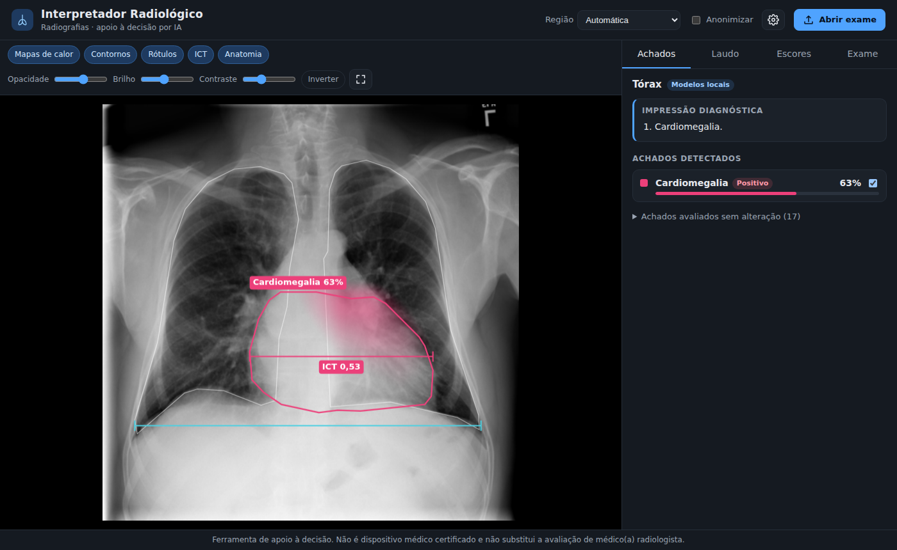
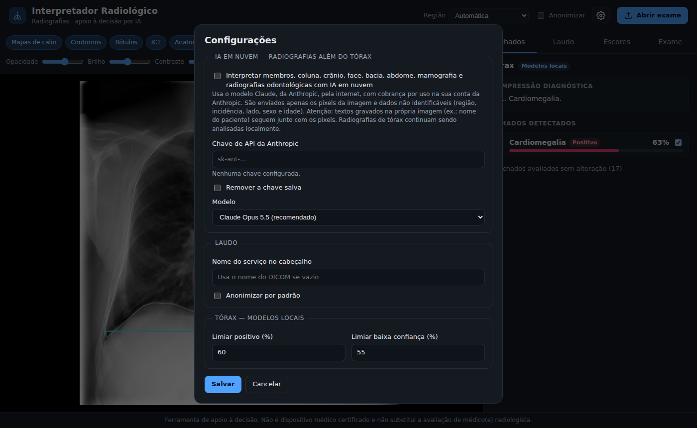
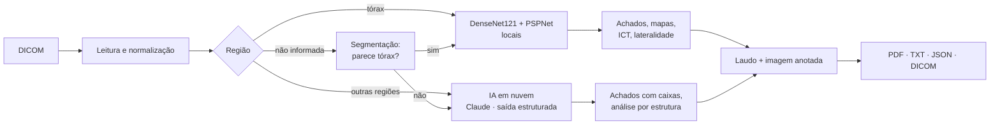

# Interpretador Radiológico

Software de **apoio à decisão** que interpreta radiografias em **DICOM**, emite um
**pré-laudo estruturado em português** e **marca na imagem os achados patológicos**.
Disponível como **programa instalável no Windows (.exe)**, interface web e linha de comando.

- **Tórax**: modelos de IA **locais** (rodam no próprio computador, sem internet): 18 achados,
  mapas de calor, contornos, lateralidade, terço pulmonar e índice cardiotorácico.
- **Todas as demais radiografias** (membros, coluna, crânio, face, bacia, abdome, mamografia e
  odontológicas): **IA multimodal em nuvem** (Claude, da Anthropic), opcional, habilitada nas
  Configurações com uma chave de API.



> **Aviso importante.** Este software não é um dispositivo médico certificado. Os resultados
> são gerados por modelos de inteligência artificial e **devem ser revisados, corrigidos e
> assinados por médico(a) radiologista**. O uso clínico no Brasil exige regularização na ANVISA
> (software como dispositivo médico — RDC nº 657/2022).

## Instalação no Windows (instalador .exe)

O instalador é gerado automaticamente pelo GitHub Actions a cada atualização do repositório:

1. No GitHub, abra **Actions → Instalador Windows** e entre na execução mais recente concluída
   com sucesso (✓).
2. Em **Artifacts**, baixe **instalador-windows** (arquivo .zip) e extraia
   `InterpretadorRadiologico-<versão>-instalador.exe`.
   Versões publicadas com uma tag `v*` (ex.: `v0.2.0`) também ficam em **Releases**.
3. Execute o instalador. Como o executável não é assinado digitalmente, o Windows SmartScreen
   pode exibir um alerta: clique em **Mais informações → Executar assim mesmo**.
4. Abra **Interpretador Radiológico** pelo menu Iniciar ou pelo atalho na área de trabalho.

Requisitos: Windows 10 ou 11 (64 bits), ~3 GB livres em disco e 8 GB de RAM recomendados. O
programa abre numa janela própria (Microsoft Edge WebView2, já presente no Windows 10/11); há
também o atalho "abrir no navegador". Os modelos de tórax e um exame de exemplo vêm embutidos:
funciona sem internet para tórax. Configurações e registros ficam em
`%APPDATA%\InterpretadorRadiologico`.

### Habilitando as demais regiões (IA em nuvem)

1. Crie uma chave de API em <https://console.anthropic.com> (cobrança por uso na sua conta da
   Anthropic; com o Claude Opus 5.5, tipicamente da ordem de US$ 0,02 a 0,15 por exame).
2. No programa, clique na engrenagem (**Configurações**), marque **Interpretar membros, coluna,
   crânio…**, cole a chave e salve.
3. Abra o exame. A região é identificada pelo DICOM; se faltar essa informação, escolha-a no
   seletor **Região** (ou deixe em "Automática" para a IA identificá-la).



Privacidade: para a nuvem são enviados **apenas os pixels da imagem** e dados não identificáveis
(região, incidência, lado, sexo e idade) — nunca nome, ID, datas ou nº de acesso. Atenção: textos
gravados na própria imagem (ex.: nome do paciente "queimado" nos pixels) seguem junto com ela.
Radiografias de tórax nunca saem do computador.

## Funcionalidades

- **Leitura de DICOM** (CR/DX/DR, mamografia MG, odontológica PX/IO): LUT de modalidade e VOI,
  janelamento, `MONOCHROME1/2`, múltiplos quadros e sintaxes comprimidas (JPEG, JPEG-LS,
  JPEG 2000). PNG/JPEG também são aceitos para demonstração.
- **Identificação da região** pelo DICOM (`BodyPartExamined`, descrições do estudo/série,
  modalidade), pela segmentação anatômica (tórax) ou pela própria IA; o usuário pode informá-la.
  Lateralidade pelo DICOM (`ImageLaterality`) ou descrição ("joelho direito").
- **Tórax (local)**: classificação de 18 achados (atelectasia, consolidação, infiltrado,
  pneumotórax, edema, enfisema, fibrose, derrame pleural, pneumonia, espessamento pleural,
  cardiomegalia, nódulo, massa, hérnia, lesão pulmonar, fratura, opacidade pulmonar e alargamento
  cardiomediastinal), mapas de ativação refinados, segmentação anatômica, lateralidade, terço
  pulmonar e **índice cardiotorácico** (em cm quando o DICOM informa o espaçamento).
- **Demais regiões (nuvem)**: análise sistemática por estruturas da região (ex.: joelho —
  alinhamento, fêmur distal, tíbia/fíbula, patela, espaços articulares, partes moles), achados com
  localização aproximada (retângulos), lado, gravidade e confiança, impressão e recomendações;
  BI-RADS sugerido na mamografia e numeração FDI na odontologia.
- **Laudo estruturado** com título por região e lado ("LAUDO DE RADIOGRAFIA DO JOELHO DIREITO"),
  técnica, análise, achados de baixa confiança, medidas, impressão, recomendações e observações.
- **Saídas**: PDF (com imagem anotada), texto, JSON, PNG anotado e, para o PACS, **DICOM
  Secondary Capture** (imagem anotada) e **DICOM Encapsulated PDF** (laudo) no mesmo estudo.
- **Interface**: visualizador com zoom/arrastar, camadas, opacidade, brilho, contraste e inversão;
  lista de achados com foco na região; **edição do laudo** e identificação do revisor (nome/CRM).
- **Verificações de segurança**: recusa modalidades não radiográficas (TC, RM…), alerta para
  incidência em perfil no tórax, paciente pediátrico, imagem espelhada/dextrocardia, divergência
  entre região informada e identificada e imagem que não parece radiografia.

## Instalação como pacote Python (Linux, macOS ou Windows)

Requer Python 3.10 ou superior.

```bash
git clone https://github.com/andersongroto/interpretador-radiologico.git
cd interpretador-radiologico
python -m venv .venv
source .venv/bin/activate            # Windows: .venv\Scripts\activate

# Opcional: PyTorch apenas para CPU (download bem menor que a versão com CUDA)
pip install torch torchvision --index-url https://download.pytorch.org/whl/cpu

pip install -e ".[dev]"              # acrescente ,desktop para a janela própria (pywebview)
interpretador-radiologico baixar-modelos   # pesos dos modelos de tórax (~300 MB, uma vez)
```

## Uso

### Interface

```bash
interpretador-radiologico-desktop       # janela própria, com Configurações (como no .exe)
interpretador-radiologico servidor      # apenas o servidor: http://127.0.0.1:8000
```

### Linha de comando

```bash
interpretador-radiologico exemplo                                  # DICOM de exemplo (NIH)
interpretador-radiologico analisar exemplo_torax_pa.dcm -o resultados/
interpretador-radiologico analisar /estudos -o resultados/ -f pdf,png,json,txt,dcm --anonimizar

# Outras regiões com IA em nuvem (chave na variável de ambiente)
export ANTHROPIC_API_KEY=sk-ant-...      # Windows: set ANTHROPIC_API_KEY=sk-ant-...
interpretador-radiologico analisar joelho.dcm --nuvem -o resultados/
interpretador-radiologico analisar imagem.png --nuvem --regiao punho
```

| Opção | Descrição |
|---|---|
| `-o, --saida PASTA` | Pasta de saída (padrão: a do arquivo) |
| `-f, --formatos` | `pdf,png,json,txt,dcm` (padrão: `pdf,png,json,txt`) |
| `--regiao CHAVE` | Força a região (`torax`, `joelho`, `mao`, `coluna_lombar`, `bacia`, `mama`…) |
| `--nuvem` | Habilita a IA em nuvem para regiões além do tórax |
| `--modelo-nuvem` | Modelo da Anthropic (padrão: `claude-opus-5-5`) |
| `--limiar-positivo 0.60` / `--limiar-indeterminado 0.55` | Limiares dos achados de tórax |
| `--anonimizar` | Remove identificação do paciente das saídas |
| `--instituicao NOME` | Nome do serviço no cabeçalho do laudo |
| `--mostrar-anatomia` | Desenha contornos de pulmões e coração (tórax) |
| `--sem-segmentacao` / `--sem-refino` | Desativa a segmentação / o refino dos mapas (tórax) |
| `--forcar` | Analisa com o modelo de tórax mesmo fora do tórax (resultado sem validade) |

Regiões reconhecidas: tórax, arcos costais, crânio, face e seios da face, odontológica, colunas
cervical, torácica, lombossacra e total, sacro/cóccix, ombro, braço, cotovelo, antebraço, punho,
mão, bacia, quadril, coxa, joelho, perna, tornozelo, pé, abdome, mamografia e "outra".

## Como funciona



- **Tórax** (`analisador.py`, `anatomia.py`, `localizacao.py`): DenseNet121 do
  [TorchXRayVision](https://github.com/mlmed/torchxrayvision) (`densenet121-res224-all`), treinada
  em oito bases públicas. O mapa de ativação de classe (CAM) é calculado em nove versões da imagem
  deslocadas em meia célula e realinhado, multiplicado por uma máscara anatômica plausível e
  convertido em contornos. O PSPNet (ChestX-Det) segmenta 14 estruturas para lateralidade, terços
  e ICT. Escores ≥ 60% são positivos; entre 55% e 60%, de baixa confiança.
- **Nuvem** (`motor_nuvem.py`): a imagem (até 1568 px) e o contexto não identificável são enviados
  ao Claude com instruções de laudo radiológico e um **esquema JSON obrigatório** (saída
  estruturada) contendo região, lado, incidências, qualidade técnica, achados (com caixas em
  coordenadas normalizadas, gravidade e confiança), análise por estrutura, impressão e
  recomendações. Recusas e erros de rede/chave são tratados com mensagens claras.
- **Laudo** (`laudo.py`, `pdf.py`) e **imagem** (`visualizacao.py`).

## Gerar o instalador

O workflow `.github/workflows/instalador-windows.yml` roda em `windows-latest`: instala as
dependências (PyTorch para CPU), executa os testes, embute os pesos e o exame de exemplo, gera o
executável com PyInstaller, **executa um autoteste do próprio .exe** (análise completa do exemplo,
geração de todas as saídas e verificação do cliente da IA em nuvem) e compila o instalador com
Inno Setup. Para gerar manualmente num Windows:

```bat
pip install torch torchvision --index-url https://download.pytorch.org/whl/cpu
pip install ".[desktop,empacotamento]"
interpretador-radiologico baixar-modelos --pesos empacotamento\recursos\pesos
interpretador-radiologico exemplo -o empacotamento\recursos
pyinstaller empacotamento\interpretador.spec --noconfirm
dist\InterpretadorRadiologico\InterpretadorRadiologico.exe --autoteste %TEMP%\autoteste
"%ProgramFiles(x86)%\Inno Setup 6\ISCC.exe" /DVersaoApp=0.2.0 empacotamento\instalador.iss
```

## Estrutura do projeto

```text
src/interpretador_radiologico/
├── analisador.py         # roteamento por região, modelos de tórax, CAM e regras
├── anatomia.py           # máscaras anatômicas, lateralidade, terços, ICT, checagens
├── cli.py                # linha de comando
├── config.py             # opções da análise
├── desktop.py            # aplicativo de desktop (janela, registro, autoteste)
├── dicom_io.py           # leitura de DICOM/imagens e metadados
├── exemplo.py            # DICOM de exemplo
├── exportacao_dicom.py   # Secondary Capture e Encapsulated PDF
├── laudo.py              # redação do laudo
├── localizacao.py        # mapas -> regiões e descrição da localização
├── motor_nuvem.py        # IA em nuvem (Claude) com saída estruturada
├── patologias.py         # catálogo de achados do tórax
├── pdf.py                # laudo em PDF
├── pipeline.py           # análise -> laudo -> arquivos
├── preferencias.py       # configurações persistentes do usuário
├── regioes.py            # catálogo de regiões e identificação pelo DICOM
├── resultado.py          # estruturas de dados do resultado
├── visualizacao.py       # desenho dos achados sobre a imagem
└── web/                  # API FastAPI e interface (HTML/CSS/JS)
empacotamento/            # PyInstaller, Inno Setup, ícone e aviso do instalador
tests/                    # testes (modelos e IA em nuvem simulados + testes com modelos reais)
```

## Testes

```bash
pytest                 # testes rápidos (modelos e API simulados, sem rede)
pytest -m modelo       # testes com os modelos de tórax reais
```

## Limitações

- Os modelos de tórax interpretam apenas incidências frontais (PA/AP); a localização por mapas de
  ativação indica as regiões que mais influenciaram o modelo, não bordas exatas de lesões.
- A interpretação em nuvem usa um modelo de linguagem multimodal de uso geral: **não é validada
  para diagnóstico**, pode errar ou omitir achados, e as caixas de localização são aproximadas.
- Os modelos não foram validados em dados locais; o desempenho varia com equipamento e população.
- Não considera dados clínicos nem exames anteriores.

## Créditos e referências

- Cohen JP *et al.* **TorchXRayVision: A library of chest X-ray datasets and models.** MIDL 2022.
  <https://github.com/mlmed/torchxrayvision>
- Lian J *et al.* **A Structure-Aware Relation Network for Thoracic Diseases Detection and
  Segmentation** (ChestX-Det). IEEE Transactions on Medical Imaging, 2021.
- Anthropic Claude (IA em nuvem opcional): <https://docs.claude.com>
- Imagem de exemplo e captura de tela: NIH ChestX-ray14 — NIH Clinical Center; Wang X *et al.*,
  *ChestX-ray8*, CVPR 2017. <https://nihcc.app.box.com/v/ChestXray-NIHCC>
